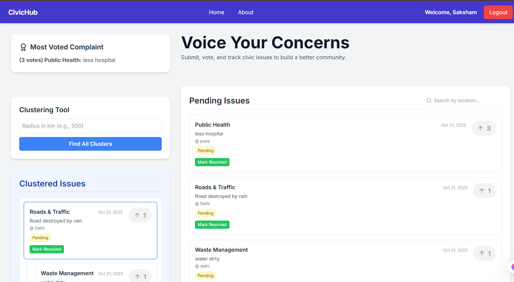

# CivicHub: A Full-Stack Civic Complaint System

CivicHub is a community-driven web application designed to empower citizens by providing a platform to report, vote on, and track local civic issues. It helps municipal authorities prioritize the most pressing concerns by using a voting system, and provides administrative tools for managing and clustering complaints based on geographical proximity.



---

## 🚀 Features

### For Citizens:
-   **User Authentication**: Secure registration and login system.
-   **File Complaints**: Users can submit new complaints with a description, location, and category.
-   **Upvote System**: Users can upvote pending complaints to increase their visibility and priority.
-   **View Issues**: A clear list of all pending issues, sorted by the number of upvotes.
-   **Search**: Efficiently search for pending issues by location.

### For Administrators:
-   **Admin Dashboard**: A distinct interface for managing all complaints.
-   **Mark as Resolved**: Admins can change the status of a complaint from "Pending" to "Resolved".
-   **Undo Action**: Admins can undo their last "Mark as Resolved" action, which reverts the complaint's status.
-   **Global Clustering Tool**: Admins can input a radius (in km) to automatically find and group all geographically related complaints into clusters.
-   **View Clusters**: Clustered issues are displayed in a separate, organized section.
-   **View Resolved Issues**: Admins can see a complete list of all resolved complaints.

---

## 🛠️ Technical Stack

-   **Frontend**: HTML5, Tailwind CSS, JavaScript (ES6+)
-   **Backend**: Python 3, FastAPI
-   **Database**: PostgreSQL with SQLAlchemy ORM
-   **External APIs**: [Open-Meteo Geocoding API](https://open-meteo.com/en/docs/geocoding-api) for converting city names to latitude/longitude coordinates.

---

## 🧠 Core Concepts & Data Structures Implemented

This project demonstrates the practical application of several key data structures and algorithms to solve real-world problems.

### 1. Priority Queue (Simulated)
-   **Concept**: A data structure where elements are served based on their priority.
-   **Implementation**: The "Pending Issues" list is always sorted in descending order of `upvotes`. This simulates a **Max-Priority Queue**, ensuring that the complaint with the highest number of votes (highest priority) is always at the top and is the first one an administrator would see.

### 2. Stack (LIFO)
-   **Concept**: A Last-In, First-Out (LIFO) data structure.
-   **Implementation**: The admin's **Undo** functionality is a direct implementation of a Stack. When an admin marks a complaint as resolved, the previous state (`{'complaint_id': ..., 'previous_status': 'Pending'}`) is pushed onto a stack (`admin_action_stacks` in `main.py`). When the undo button is clicked, the most recent action is popped from the stack, and the complaint's status is reverted.

### 3. Trie (Prefix Tree)
-   **Concept**: A tree-like data structure used for efficient retrieval of keys in a dataset of strings.
-   **Implementation**: The search bar for pending issues uses a Trie (`pendingComplaintsTrie` in `script.js`). All unique locations are inserted into the Trie. When a user types a search query (e.g., "lon"), the Trie can instantly return all locations that start with that prefix (e.g., "London"), providing a fast and efficient search and autocomplete experience.

### 4. Graph Traversal (BFS) and Queue (FIFO)
-   **Concept**: The global clustering tool treats all pending complaints as nodes in a graph. An edge exists between two nodes if they are within the specified radius. The goal is to find all connected components (the clusters).
-   **Implementation**: The `/admin/cluster-all` endpoint uses a **Breadth-First Search (BFS)** algorithm to find these clusters. BFS is implemented using a **Queue** (a Python `list` where items are removed from the front).
    -   The algorithm iterates through each unvisited complaint.
    -   It adds the complaint to a queue and begins exploring its neighbors.
    -   Any neighbor within the radius is added to the queue and the cluster.
    -   This continues until the entire connected group is found. A `visited` **Set** is used for efficient `O(1)` lookups to avoid reprocessing complaints.

---

## ⚙️ Setup and Installation

To run this project locally, follow these steps:

### Prerequisites
-   Python 3.8+
-   PostgreSQL
-   A web browser

### 1. Clone the Repository
```bash
git clone [https://github.com/saksham-s18/dsa-project.git](https://github.com/saksham-s18/dsa-project.git)
cd your-repo-name
```

### 2. Backend Setup
Create a virtual environment and activate it.
```bash
# For Windows
python -m venv venv
venv\Scripts\activate

# For macOS/Linux
python3 -m venv venv
source venv/bin/activate
```
Install the required Python packages.
```bash
pip install fastapi uvicorn "sqlalchemy[psycopg2-binary]" requests
```
> **Note**: For a real project, you would create a `requirements.txt` file.

Start the backend server.
```bash
uvicorn main:app --reload
```
The server will be running at `http://127.0.0.1:8000`.

### 3. Frontend Setup
No special setup is needed. Simply open the `index.html` file in your web browser. The application will connect to the running backend server automatically.

---

## 🔌 API Endpoints

The backend exposes the following RESTful API endpoints:

| Method | Path                                 | Description                                  |
| :----- | :----------------------------------- | :------------------------------------------- |
| `POST` | `/register`                          | Create a new user account.                   |
| `POST` | `/login`                             | Log in a user.                               |
| `POST` | `/complaint`                         | Submit a new complaint.                      |
| `GET`  | `/complaints`                        | Get a list of all complaints.                |
| `POST` | `/complaint/{id}/upvote`             | Upvote a specific complaint.                 |
| `GET`  | `/complaints/most_voted`             | Get the single most-voted pending complaint. |
| `GET`  | `/complaints/clustered`              | Get all identified complaint clusters.       |
| `PUT`  | `/admin/complaint/{id}/status`       | (Admin) Update the status of a complaint.    |
| `POST` | `/admin/undo`                        | (Admin) Undo the last status change.         |
| `POST` | `/admin/cluster-all`                 | (Admin) Run the global clustering algorithm. |

---

## 👨‍💻 Author

-   **Saksham Singh** 
